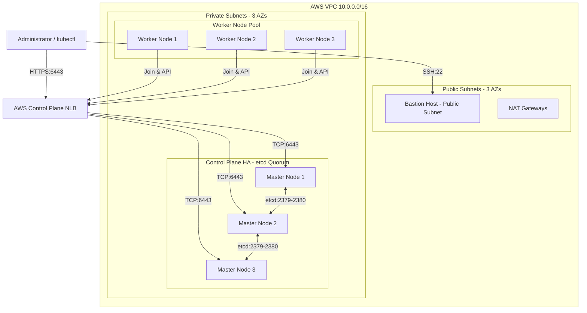

# AWS Multi-Master Production-Ready Kubernetes Cluster

[](https://www.terraform.io/)
[](https://kubernetes.io/)
[](https://containerd.io/)
[](https://aws.amazon.com/)

A production-grade, highly available (HA) multi-master Kubernetes cluster automation repository on AWS EC2 using **Terraform** for infrastructure orchestration and modular **Bash scripts** for node configuration and cluster bootstrapping.

---

## 🌟 Architecture Overview



---

## ✨ Features

- **Multi-Master High Availability (HA)**: 3 Control Plane nodes spread across 3 AWS Availability Zones behind an AWS Network Load Balancer (NLB) for zero-downtime control plane API access.
- **Strict Private Isolation**: Control plane and worker instances reside in private subnets with no public IPs. Internet access for updates is securely routed through NAT Gateways.
- **Bastion Access Model**: Single entry point SSH Bastion host with restricted IP CIDR ingress rules for cluster operations.
- **Modular Infrastructure Code**: Clean separation of Terraform modules (`vpc`, `security_groups`, `iam`, `key_pair`, `load_balancer`, `ec2`) supporting multi-environment deployments (`dev`, `prod`).
- **Idempotent Operating System Tuning**: Standardized bash scripts handling Linux kernel parameters (`overlay`, `br_netfilter`), sysctl tuning (`net.ipv4.ip_forward = 1`), swap disabling, and `containerd` systemd cgroups.
- **Automated Join Secret Management**: Automated upload and retrieval of `kubeadm` join tokens and certificate keys via AWS SSM Parameter Store with IAM least-privilege scoping.
- **Container Network Interface (CNI)**: Pre-configured Calico CNI overlay networking (BGP & VXLAN support).

---

## 📂 Repository Structure

```text
.
├── README.md                           # Master Project Documentation
├── docs/
│   ├── architecture.md                 # Deep-Dive Architectural & Port Specification Guide
│   └── execution_guide.md              # Detailed Step-by-Step Deployment & Troubleshooting Guide
├── scripts/
│   ├── common.sh                       # OS prep, kernel modules, sysctl, containerd setup
│   ├── install_k8s.sh                  # Apt repo setup, holding & installing kubeadm/kubelet/kubectl
│   ├── init_first_master.sh            # Primary master initialization & Calico CNI setup
│   ├── join_master.sh                  # Secondary control plane node cluster join script
│   └── join_worker.sh                  # Worker node cluster join script
├── templates/
│   ├── user_data_bastion.sh.tftpl      # Bastion initialization cloud-init template
│   ├── user_data_master_first.sh.tftpl # First control plane bootstrap cloud-init template
│   ├── user_data_master_join.sh.tftpl  # Secondary control plane cloud-init template
│   └── user_data_worker.sh.tftpl       # Worker node cloud-init template
├── terraform/
│   ├── environments/
│   │   ├── dev/                        # Development Environment Configuration
│   │   └── prod/                       # Production Environment Configuration
│   └── modules/
│       ├── vpc/                        # VPC, Subnets, IGW, NAT GW, Route Tables
│       ├── security_groups/            # Least-privilege Security Group Rules
│       ├── iam/                        # IAM Roles, Policies, Instance Profiles
│       ├── key_pair/                   # SSH Key Management
│       ├── load_balancer/              # AWS Network Load Balancer (NLB) for API server
│       └── ec2/                        # EC2 Instances for Bastion, Masters, and Workers
```

---

## 📋 Prerequisites & Tool Versions

| Software / Tool | Minimum Version | Recommended Version |
| :--- | :--- | :--- |
| **Terraform** | `>= 1.5.0` | `1.9.x` |
| **AWS CLI** | `>= 2.0.0` | `2.17.x` |
| **Kubernetes** | `v1.30.0` | `v1.31.0` |
| **containerd** | `v1.6.0` | `v1.7.x` |
| **Ubuntu Server** | `22.04 LTS` | `24.04 LTS` |

---

## 🚀 Quickstart Deployment

### 1. Clone & Navigate to Environment
```bash
git clone https://github.com/robin0904/aws-multi-master-kubernetes-setup.git
cd aws-multi-master-kubernetes-setup/terraform/environments/dev
```

### 2. Configure Variables
```bash
cp terraform.tfvars.example terraform.tfvars
```
*Modify `allowed_ssh_cidr_blocks` in `terraform.tfvars` with your public IP address.*

### 3. Initialize & Deploy Infrastructure
```bash
terraform init
terraform plan -out=tfplan
terraform apply tfplan
```

### 4. Connect to Cluster
```bash
# Save SSH private key
terraform output -raw private_key_pem > id_rsa_k8s && chmod 600 id_rsa_k8s

# SSH into primary control plane node via Bastion Proxy
ssh -i id_rsa_k8s -J ubuntu@$(terraform output -raw bastion_public_ip) ubuntu@<PRIMARY_MASTER_PRIVATE_IP>

# Verify nodes
kubectl get nodes -o wide
```

---

## 🔒 Security Highlights

- **IMDSv2 Enforced**: All EC2 instances enforce `http_tokens = "required"` to protect instance metadata from SSRF attacks.
- **Private Subnet Placement**: Nodes have zero direct public IP exposure; ingress is strictly filtered through Security Group references and Bastion proxy SSH tunnels.
- **EBS Encryption**: All root EBS volumes are encrypted by default with AWS managed KMS keys.
- **Least-Privilege IAM**: IAM roles grant only essential permissions (SSM Parameter Store for join token coordination and read-only EC2 description).

---

## 🛠️ Maintenance & Cleanup

To destroy all provisioned resources cleanly:

```bash
cd terraform/environments/dev
terraform destroy -auto-approve
```

---

## 📖 Further Documentation

- Refer to [docs/architecture.md](file:///Users/rohan.n/Desktop/Rohan-Learning/aws-multi-master-kubernetes-setup/docs/architecture.md) for network topologies, port matrix, and design choices.
- Refer to [docs/execution_guide.md](file:///Users/rohan.n/Desktop/Rohan-Learning/aws-multi-master-kubernetes-setup/docs/execution_guide.md) for full deployment instructions, verification steps, and troubleshooting tips.
