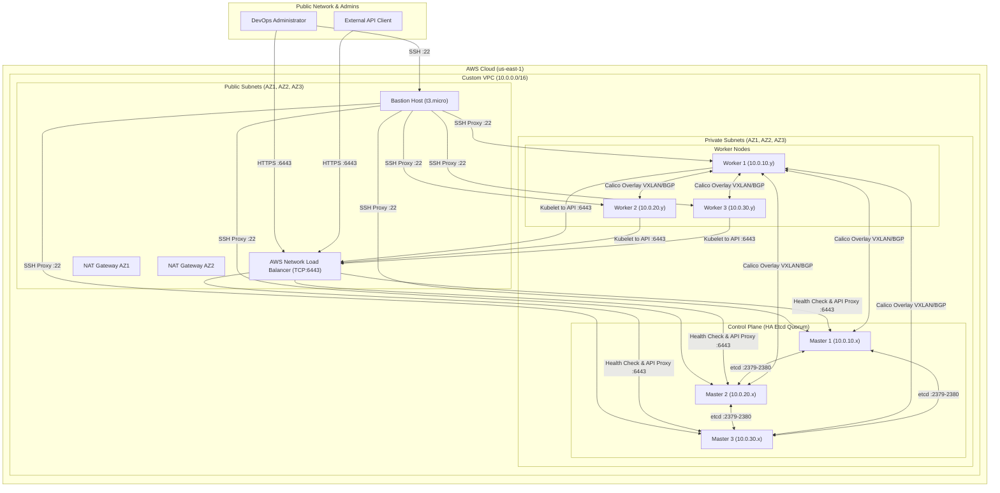

# AWS Multi-Master Kubernetes Setup — Architectural Guide

## Executive Summary
This document outlines the design decisions, component interactions, security model, and execution workflows for deploying a High Availability (HA) Kubernetes Multi-Master Cluster on AWS using Terraform and automated Bash scripts.

---

## Architecture & Topology

---

## Technical Design Decisions

### 1. High Availability Control Plane Strategy
- **Control Plane Endpoint**: The Kubernetes API servers run on all 3 Master nodes listening on port 6443. An AWS Network Load Balancer (NLB) provides a single static DNS entry (`--control-plane-endpoint`) for `kubeadm init` and `kubeadm join`.
- **etcd Quorum**: Etcd requires an odd number of members to maintain quorum against node failures. 3 Master nodes placed across 3 distinct AWS Availability Zones tolerate the failure of 1 Control Plane node without downtime or data loss.

### 2. Network Isolation & Egress Control
- **Private Subnets**: All Master and Worker nodes live in private subnets with no direct internet-facing public IP addresses.
- **NAT Gateways**: Outbound egress (for OS packages, container images, apt repos) is routed via NAT Gateways in public subnets.
  - In **Dev**, a single NAT Gateway is shared across private subnets to optimize AWS costs.
  - In **Prod**, multi-AZ NAT Gateways are provisioned for redundant fault tolerance.

### 3. Container Runtime & Cgroup Management
- **Runtime**: `containerd` (v1.7+) is configured with `SystemdCgroup = true` in `/etc/containerd/config.toml`.
- **Systemd Integration**: Enforcing systemd as the cgroup driver for both `kubelet` and `containerd` prevents resource allocation conflicts under heavy node loads.

### 4. Cluster Networking & CNI
- **CNI Plugin**: Calico CNI (v3.28.0) is deployed during initial master bootstrapping.
- **Overlay Routing**: Calico handles pod IP allocation (`192.168.0.0/16`) and cross-node communication via IP-in-IP / VXLAN and BGP peering on port 179.

---

## Network Security & Port Matrix

| Source | Destination | Protocol / Port | Purpose |
| :--- | :--- | :--- | :--- |
| Admin IP | Bastion SG | TCP 22 | SSH Bastion Access |
| Bastion SG | Master/Worker SGs | TCP 22 | Internal Administration SSH |
| VPC / Bastion | NLB SG | TCP 6443 | Kubernetes API Server Access |
| NLB SG | Master SG | TCP 6443 | API Server Traffic Forwarding |
| Master SG | Master SG | TCP 2379-2380 | etcd client/peer communication |
| Master/Worker SG | Master SG | TCP 6443 | Control Plane API server access |
| Master SG | Master/Worker SGs | TCP 10250 | Kubelet API |
| Master SG | Master SG | TCP 10257 | Kube-controller-manager |
| Master SG | Master SG | TCP 10259 | Kube-scheduler |
| Master & Worker SGs | Master & Worker SGs | TCP 179, UDP 4789, IP-in-IP (4) | Calico CNI Overlay Networking |
| VPC CIDR | Worker SG | TCP 30000-32767 | Kubernetes NodePort Range |

---

## Workflows & Automation Mechanics

### Terraform Provisioning Workflow
1. **Module Hierarchy**: Terraform executes in standard order: `vpc` -> `security_groups` -> `iam` -> `key_pair` -> `ec2` -> `load_balancer`.
2. **User Data Template Interpolation**: Shell scripts inside `scripts/` are read as plain text and dynamically injected into cloud-init template files (`templates/*.tftpl`) with variables like `control_plane_endpoint` (NLB DNS) and `k8s_version`.

### Bootstrap & Cluster Join Workflow
1. **First Master Bootstrapping**:
   - `common.sh` disables swap, tunes sysctl (`net.ipv4.ip_forward = 1`), loads `overlay`/`br_netfilter`, and installs `containerd`.
   - `install_k8s.sh` installs `kubelet`, `kubeadm`, `kubectl` from official Kubernetes apt repositories.
   - `init_first_master.sh` runs `kubeadm init --control-plane-endpoint <NLB>:6443 --upload-certs --pod-network-cidr 192.168.0.0/16`.
   - Calico CNI manifest is automatically applied.
   - Initializer generates join tokens and uploads parameters (`token`, `ca_hash`, `cert_key`, `endpoint`) to AWS SSM Parameter Store.
2. **Secondary Masters & Workers Bootstrap**:
   - Secondary masters and workers execute `common.sh` and `install_k8s.sh`.
   - Secondary masters query AWS SSM for cluster join parameters and run `join_master.sh`.
   - Workers query AWS SSM for cluster join parameters and run `join_worker.sh`.
